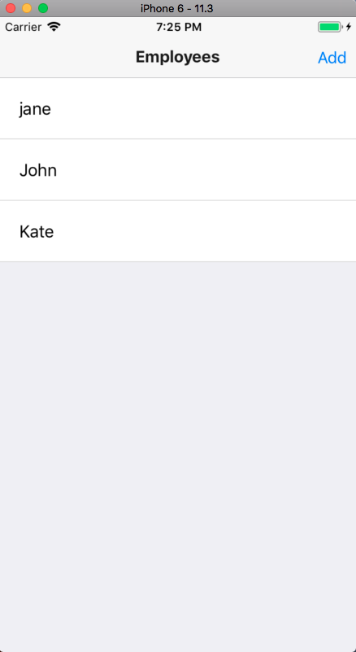
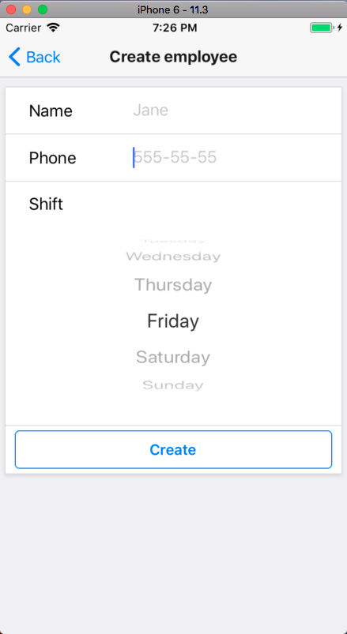
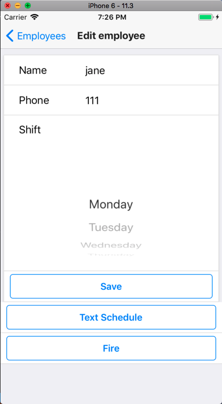
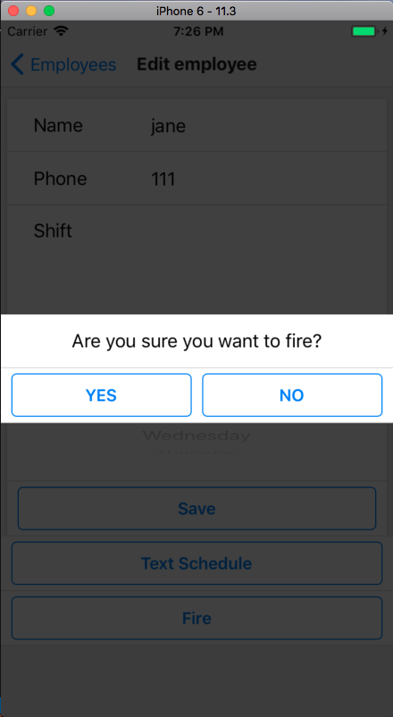

# manager-app

## Description

The application is for managing staff. Written with using [react], [react-native] and [redux].

## Screens

###Login

###Employee list

###Create employee

###Edit employee

###Fire (Delete) employee

## Libraries:
- [react-native-router-flux] used for navigation
- [redux-thunk] for asynchronous actions
- [firebase-auth] for user managment
- [firebase-realtime-database] as backend
- [lodash] for util purposes

[react]: <https://reactjs.org>
[react-native]: <https://facebook.github.io/react-native/>
[redux]: <https://redux.js.org/introduction>
[react-native-router-flux]: <https://github.com/RNRF/react-native-router-flux>
[redux-thunk]: <https://github.com/reduxjs/redux-thunk>
[firebase-auth]: <https://firebase.google.com/docs/auth/>
[firebase-realtime-database]: <https://firebase.google.com/docs/database/>
[lodash]: <https://lodash.com/>